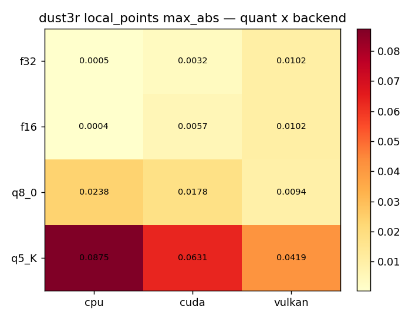
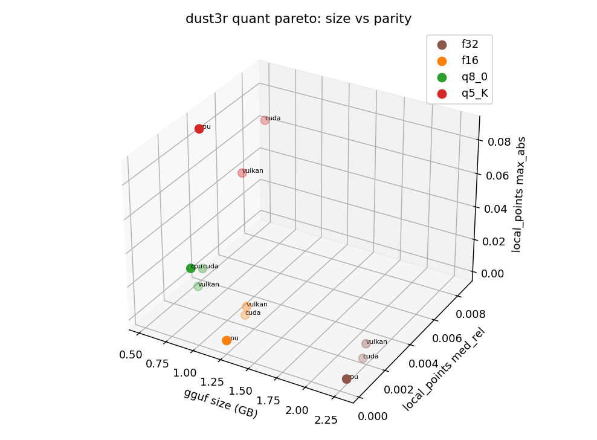
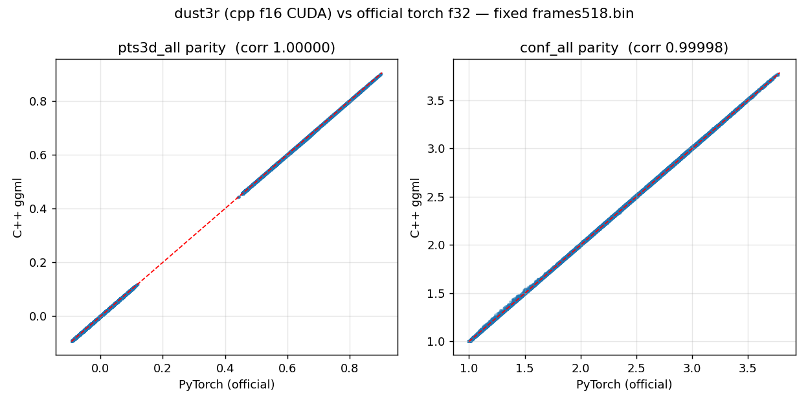
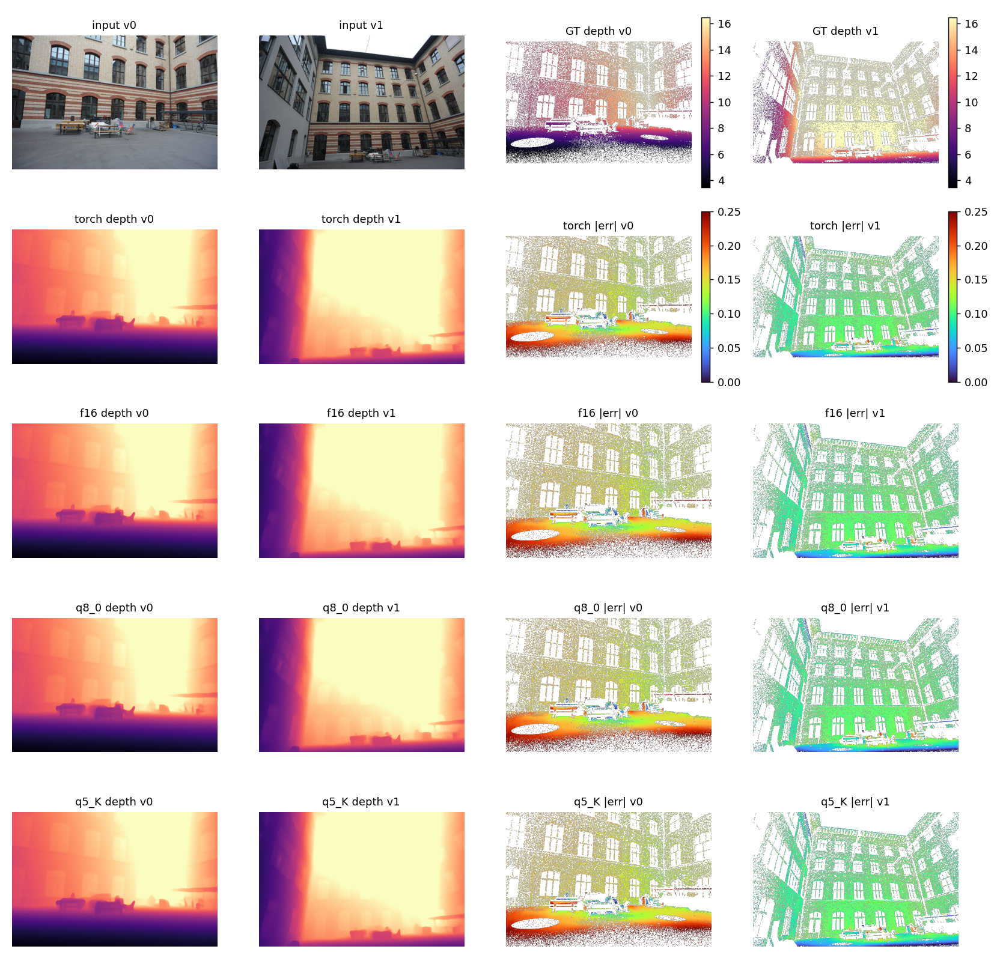
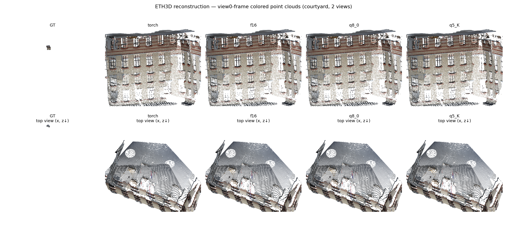
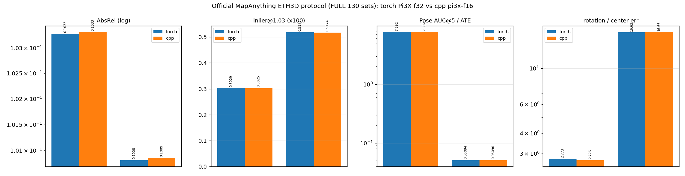
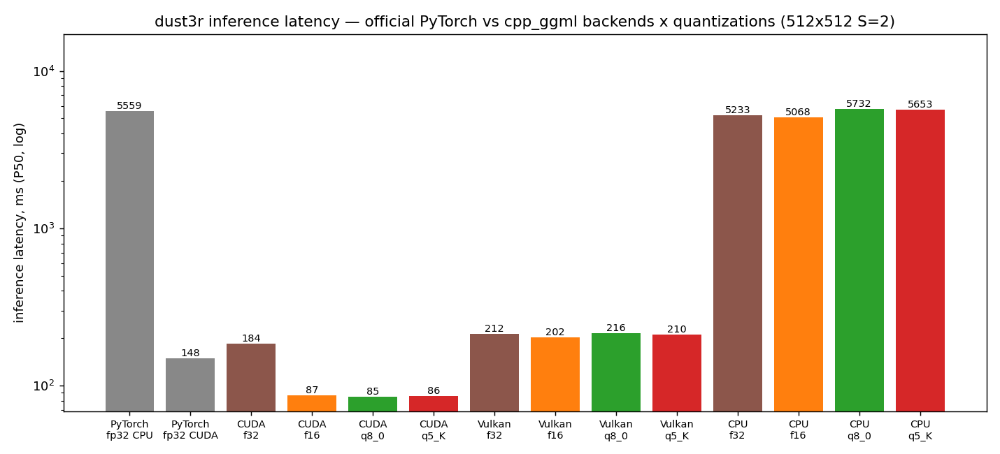

# DUSt3R (M5) — C++ ggml integration report (2026-09-23)

Model: `naver/DUSt3R_ViTLarge_BaseDecoder_512_dpt` (571.2M, CroCo ViT-L/16
encoder + 12 cross-attention decoder pairs + dual DPT heads). The
**pair-wise third output family**: no pose head; poses are recovered by the
closed-form rigid Procrustes over the two heads' pointmaps (the same
implementation on both sides, no K / no GT / no iterations).

## 1. Gate matrix (4 quants x 3 backends) — 12/12 PASS

Fixed 512x512 S=2 teaser frames, torch f32 reference. local_points med_rel:
f16/f32 0.0002 -> q8_0 0.0016-0.0024 -> q5_K 0.0039-0.0087. The most
quantization-robust architecture in the repo (the DPT head has no
pi3x-style ConvHead amplification chain). See
[../results/gate_matrix.md](../../results/gate_matrix.md) and
[../results/dust3r/gate_matrix_log.txt](../../results/dust3r/gate_matrix_log.txt).

## 2. Official ETH3D protocol (130 sets x 2 views, seed 777, 512x336) — two-sided parity

The official protocol itself is `num_views=2`, a natural fit for the
pair-wise model. Pose recovery: run A (v0,v1) yields view0's own pointmap
plus view1's pointmap (in view0's frame); run B (v1,v0) yields view1's own
pointmap; the two heads' pointmaps share pixel correspondences ->
closed-form rigid alignment.

| metric | torch f32 | cpp f16 | rel delta |
|---|---|---|---|
| pointmaps_abs_rel | 0.100810 | 0.100855 | 0.04% |
| z_depth_abs_rel | 0.103279 | 0.103310 | 0.03% |
| pose_ate_rmse | 0.050941 | 0.050955 | 0.03% |
| rot_err_deg | 2.773 | 2.726 | 1.7% |
| rot_auc_30 (x100) | 56.44 | 56.36 | 0.14% |
| ray_dirs_err_deg | 2.4215 | 2.4213 | 0.01% |

(metric_scale_abs_rel has no metric-head semantics for dust3r; both sides
agree and it is carried as a placeholder.)
Full table:
[../results/dust3r/bench_official_eth3d_dust3r.md](../../results/dust3r/bench_official_eth3d_dust3r.md)

## 3. Real-scene reconstruction comparison (courtyard, window [5,0], 512x336)

cpp f16 vs torch: AbsRel 0.132052 vs 0.132059 (delta 0.005%); pose delta
rot 0.000° / trans 0.00003 m. q8_0/q5_K pose deltas 0.020° / 0.014°.

Comparison table: [recon_comparison.md](recon_comparison.md)

## 4. Speed (512x512x2, RTX 4090, official fp32 torch baseline)

| Backend | torch f32 | cpp f32 | cpp f16 | cpp q8_0 | cpp q5_K |
|---|---|---|---|---|---|
| CUDA | 148.2 ms | 184.2 | **86.6 ms(1.71x)** | **84.9 ms(1.75x)** | 86.2 ms(1.72x) |
| Vulkan | — | 212.3 | 201.6 (0.74x) | 216.2 (0.69x) | 210.1 (0.71x) |
| CPU | 5558.9 ms | 5233.2 (1.06x) | **5068.0 (1.10x)** | 5731.8 (0.97x) | 5653.0 (0.98x) |

CUDA 1.71-1.75x is one of the largest advantages over an official baseline
in the repo. Re-measured 2026-09-24: the CPU row comes from an exclusive
retest; the f32 column and the Vulkan row are new (there was no Vulkan
latency JSON before).
See [../results/dust3r/speed_dust3r.md](../../results/dust3r/speed_dust3r.md).

## 5. Relation to the other integrated models

DUSt3R is the family's common ancestor (2024, pair-wise); VGGT (2025) made
it N-view; Pi3/Pi3X simplified the heads; MapAnything unified the three.
On the C++ side there are three output families: the vggt family
(pose_enc 9), the pi3 family (c2w 4x4), and the dust3r family (no pose,
both views in view1's frame). The cross-attention decoder and the
dust3r-style 4-branch DPT input are both first-time additions to this
repo's component library, paving the way for MASt3R (matcher).
