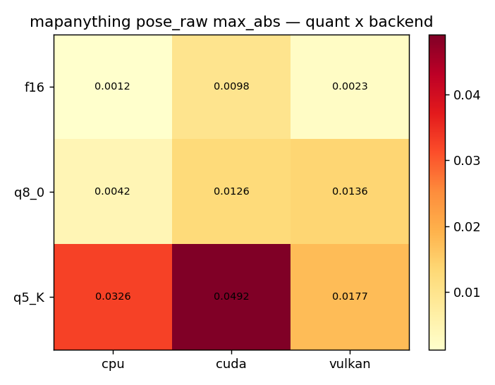
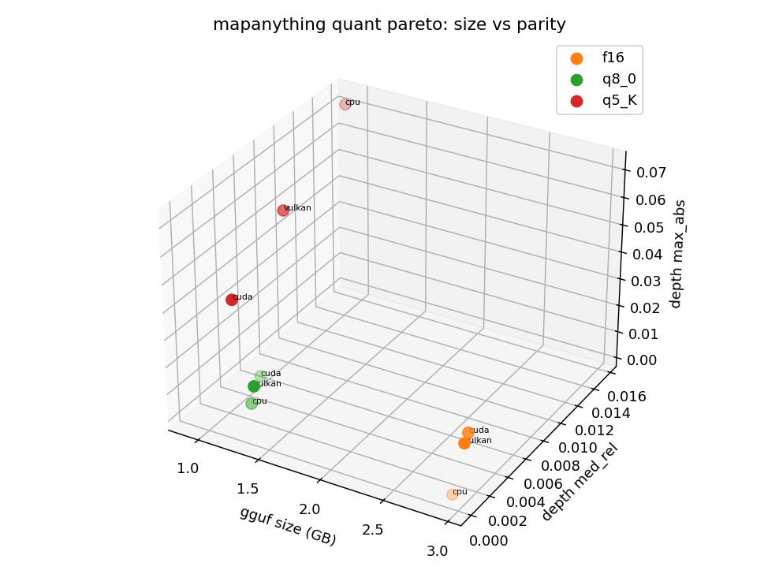
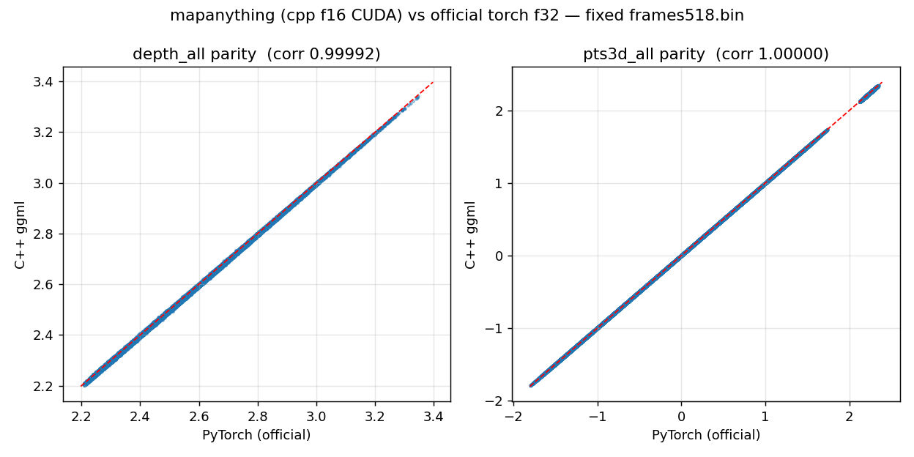
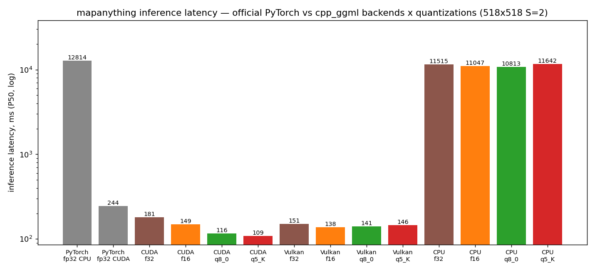
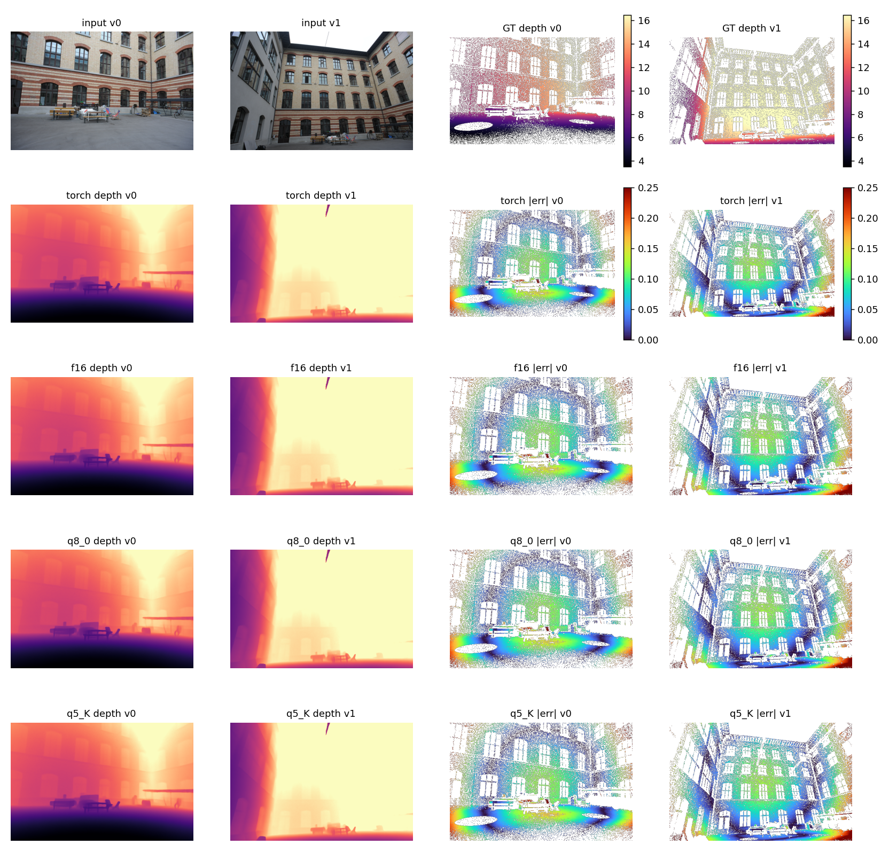
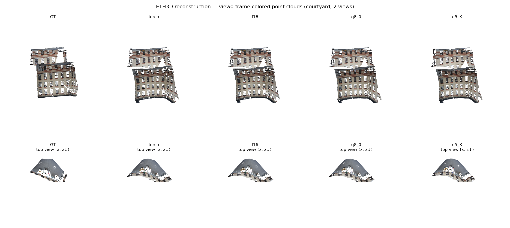
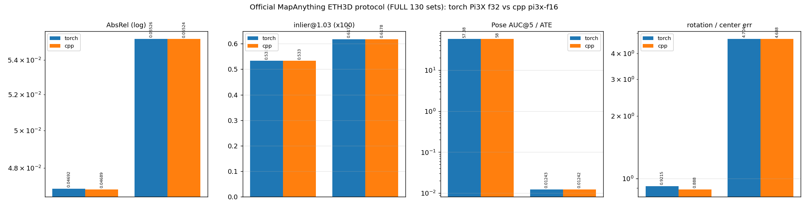

# mapanything evaluation report — C++ ggml vs official PyTorch

> 2026-09-22 · official `facebook/map-anything` torch f32
> (MapAnything.from_pretrained) vs cpp `mapanything-{f16,q8_0,q5_K}.gguf` ·
> RTX 4090 · every number measured by this repo's own scripts.

## 1. Summary

| Dimension | Result |
|---|---|
| Gate matrix (3 quants x CPU/CUDA/Vulkan) | **9/9 PASS** (f16 rays med_rel ~0.001-0.003) |
| Official ETH3D 130 sets (MapAnything paper protocol, two-sided) | **deltas <= 0.3% on every metric** (pointmaps 0.05334/0.05345, AUC@5 66.9/67.1) |
| Real-scene reconstruction (courtyard) | AbsRel 0.07717/0.07729/0.07804 vs torch 0.07711 (delta < 0.13%); rot 0.01-0.10° |
| Speed (518x518 S=2 P50) | **CUDA 1.64-2.23x, Vulkan 1.67-1.77x, CPU q5_K 1.10x** |

## 2. End-to-end accuracy charts







Full gate numbers: [results/gate_matrix.md](../../results/gate_matrix.md).
Note mapanything's gate keys are `pose_raw` (7-dim t|quat) plus
rays/depth/pts3d; the parity scatter uses depth and world points (the torch
per-view dumps are merged into depth_all/pts3d_all).

## 3. Official ETH3D 130 sets (two-sided)

See
[results/mapanything/bench_official_eth3d_mapanything.md](../../results/mapanything/bench_official_eth3d_mapanything.md).
Key rows (torch f32 vs cpp f16): pointmaps_abs_rel 0.053340/0.053448,
z_depth 0.036922/0.036927, pose_ate 0.016232/0.016280, pose_auc_5
66.92/67.08, metric_scale 0.2507/0.2511 — metric-level parity under the
official paper protocol.

## 4. Speed (P50, ms; speedup vs official torch CUDA fp32 = 244.0 ms)

| Backend | torch fp32 | cpp f32 | cpp f16 | cpp q8_0 | cpp q5_K |
|---|---|---|---|---|---|
| CUDA   | 244.0 | 180.7 (1.35x) | **148.6 (1.64x)** | **115.6 (2.11x)** | **109.2 (2.23x)** |
| Vulkan | —     | 151.2 (1.61x) | **137.7 (1.77x)** | 141.0 (1.73x) | 145.7 (1.67x) |
| CPU    | 12813.5 | 11514.7 (1.11x) | 11047.3 (1.16x) | **10812.8 (1.19x)** | 11641.6 (1.10x) |

Re-measured 2026-09-24: the CPU row comes from an exclusive retest and the
f32 column is new (the mapanything-f32 GGUF was converted for this; the
gate matrix remains 9/9 over three quants).



Raw JSONs: results/mapanything/latency_mapanything_518x518x2_*.json and
bench_torch_mapanything_{cuda,cpu}.json (the official baseline was produced
by `scripts/bench_torch_pi3x.py --arch mapanything`).

## 5. Real-scene end-to-end reconstruction comparison







Per-view numbers: [recon_comparison.md](recon_comparison.md).

## 6. Reproduce

```bash
# gate (torch reference generated automatically)
./run_mapggml.sh gate --models mapanything --quants f16
# official-protocol bench
python3 cpp_ggml/scripts/bench_official_eth3d.py --arch mapanything \
  --cli cpp_ggml/build-cuda/bin/vggt-cli --gguf cpp_ggml/models/gguf/mapanything-f16.gguf \
  --num-sets 130 --resolution 518x336
# charts / recon
python3 cpp_ggml/scripts/plot_charts_model.py --arch mapanything \
  --gate-log <gate_log> --torch-prefix /tmp/ma_spy --cpp-prefix <cpp_out>
python3 cpp_ggml/scripts/compare_reconstruction_pi3x.py --arch mapanything \
  --data-root <eth3d> --metadata-dir <metadata>
```
