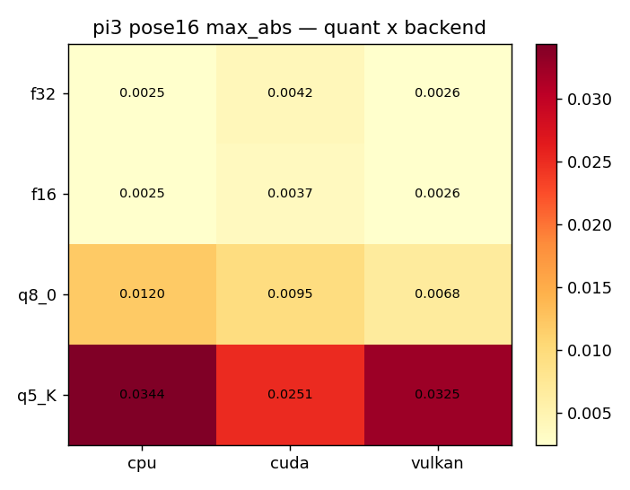
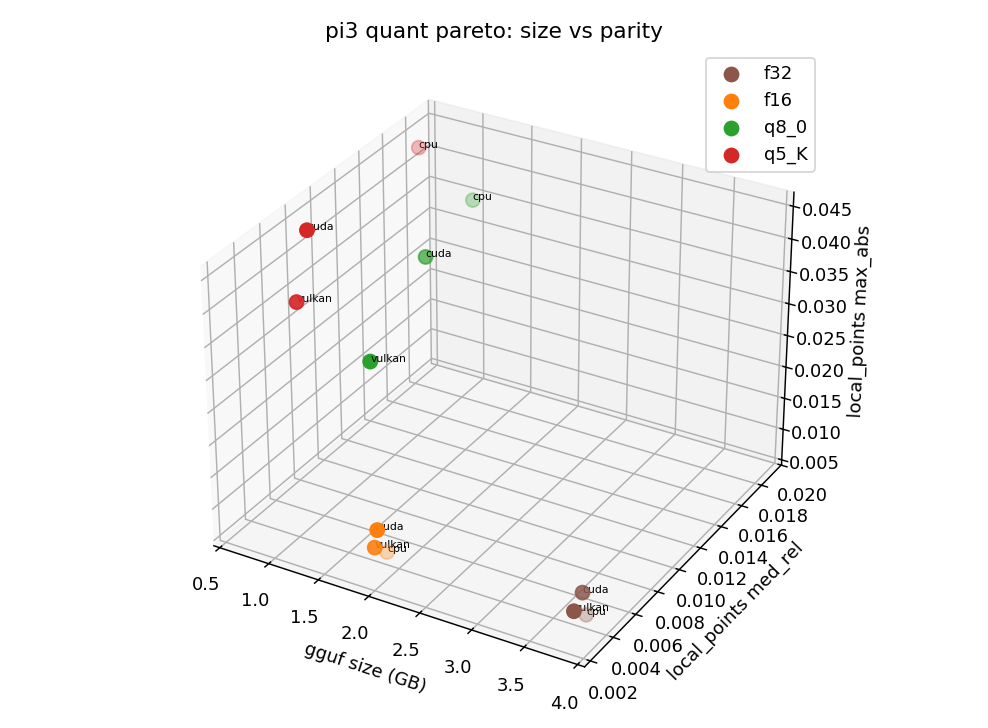
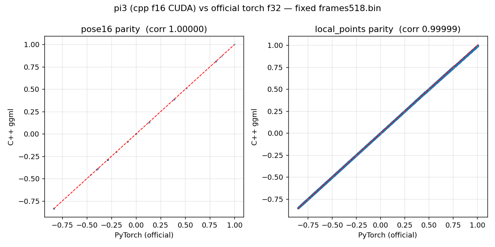
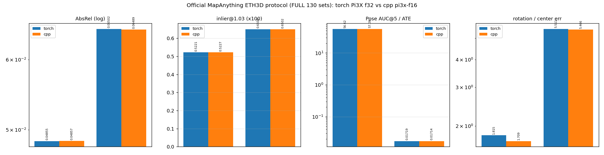
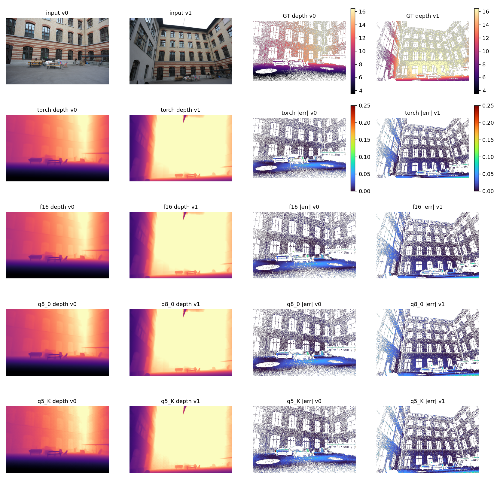
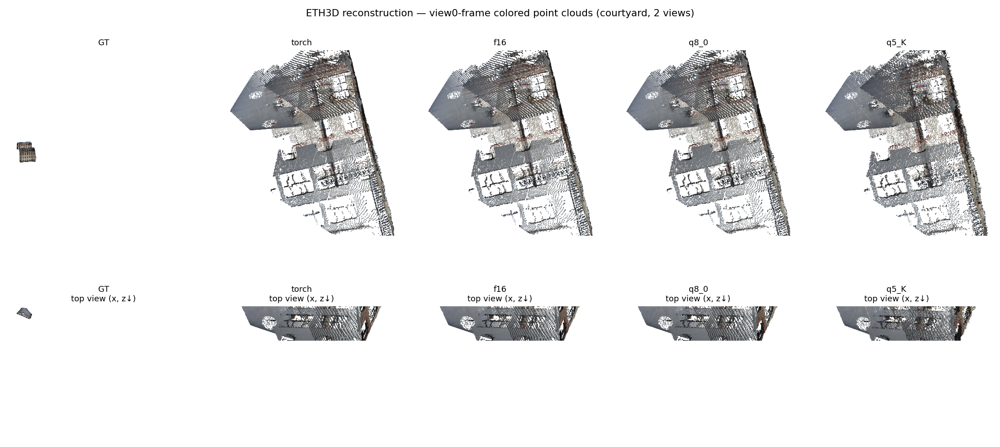
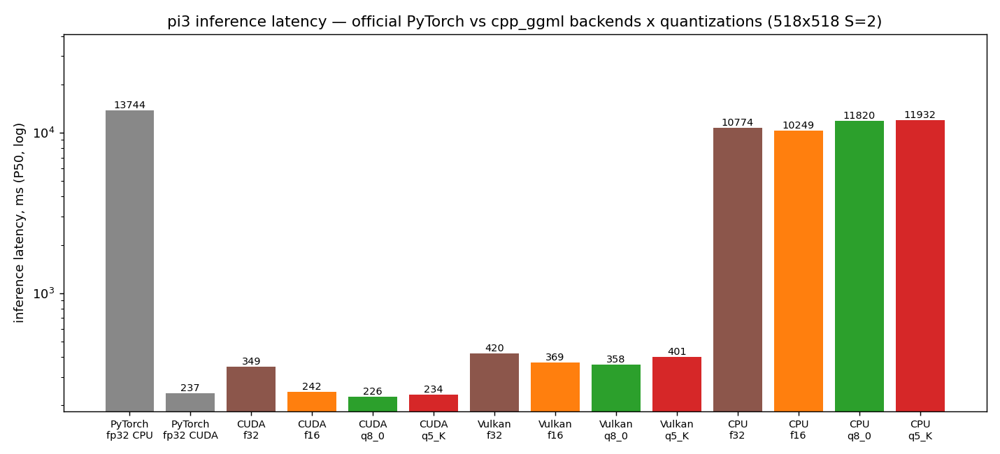

# pi3 evaluation report — C++ ggml vs official PyTorch

> 2026-09-22 · official torch f32 forward vs cpp `pi3-{f16,q8_0,q5_K}.gguf` ·
> RTX 4090 · every number measured by this repo's own scripts.

## 1. Summary

| Dimension | Result |
|---|---|
| Gate matrix (4 tiers x CPU/CUDA/Vulkan) | **12/12 PASS** (f16 lp med_rel 0.0004-0.0037; K tier = q5_K — pi3's best depth/rot/ATE/pointmaps tier on the 130 sets; q6_K removed 10-01, no best metric) |
| Official ETH3D 130 sets (MapAnything protocol, two-sided) | metric-level parity (pointmaps 0.0429/0.0423 etc.) |
| Paper protocol, 13 scenes (Acc/Comp/NC + Umeyama/ICP) | torch/cpp deltas <= 0.01 on every metric; comp_med 0.1251/0.1236 pinned to the paper's 0.128 |
| Real-scene reconstruction (courtyard) | f16 within 1% of torch on every metric; pose rot 0.0000° |

## 2. End-to-end accuracy charts







Full gate numbers: [results/gate_matrix.md](../../results/gate_matrix.md).

## 3. Official ETH3D 130 sets + paper protocol

See
[results/pi3/bench_official_eth3d_pi3.md](../../results/pi3/bench_official_eth3d_pi3.md)
and
[results/pi3/eval_pi3_paper_eth3d.md](../../results/pi3/eval_pi3_paper_eth3d.md).



## 4. Real-scene reconstruction comparison (courtyard, window [5, 0], 518x336)

| metric | torch | f16 | q8_0 | q5_K |
|---|---|---|---|---|
| AbsRel | 0.013730 | 0.013543 | 0.014092 | 0.014039 |
| d1 | 0.999174 | 0.999159 | 0.999166 | 0.999069 |
| chamfer | 0.010894 | 0.010721 | 0.010994 | 0.010034 |
| pose rot diff (deg) | — | **0.000** | 0.121 | 1.209 |
| pose trans diff (m) | — | 0.002 | 0.005 | 0.015 |





## 5. Speed (P50, ms, log axis)



| Backend | torch fp32 (CUDA / CPU) | cpp f32 | cpp f16 | cpp q8_0 | cpp q5_K |
|---|---|---|---|---|---|
| CUDA | 237.4 | 348.5 | 242.0 | **226.4 (1.05x)** | 234.0 |
| Vulkan | — | 420.3 | 368.7 | 358.2 | 400.5 |
| CPU | 13744.2 | 10774.2 (1.28x) | **10249.3 (1.34x)** | 11820.5 (1.16x) | 11932.1 (1.15x) |

pi3's CUDA is on par with the official baseline (q8_0 slightly faster); the
CPU side is faster than official fp32 torch across the board (f16 1.34x).
Re-measured 2026-09-24: the CPU row comes from an exclusive-CPU retest (an
earlier batch ran concurrently with a full-core build, which contaminated
f16 to 17609); the f32 column is new.

## 6. Reproduce

```bash
scripts/e2e_gate_matrix.sh pi3 "f16 f32 q8_0 q5_K"
python3 scripts/bench_official_eth3d.py ... --arch pi3 --num-sets 130
PYTHONPATH=/tmp/torch_cuda_lib:. python3 scripts/eval_pi3_paper_eth3d.py ... --side torch --arch pi3
PYTHONPATH=/tmp/torch_cuda_lib:. python3 scripts/compare_reconstruction_pi3x.py --arch pi3 --data-root ... --metadata-dir ...
python3 scripts/plot_charts_model.py --arch pi3 --gate-log <gate.log> \
    --torch-prefix /tmp/pi3_spy2 --cpp-prefix <cpp-f16-prefix>
```
