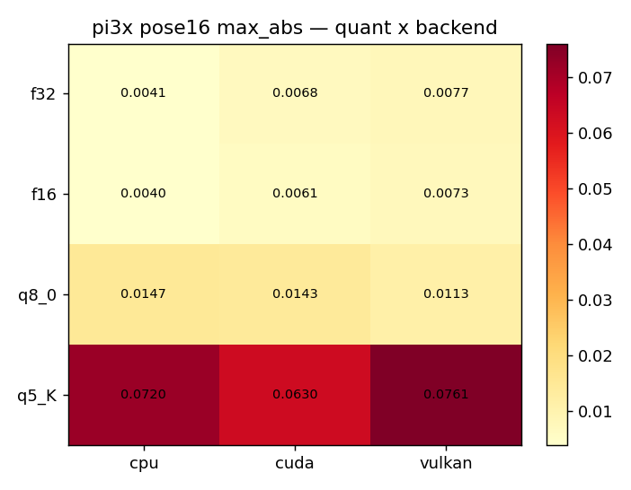
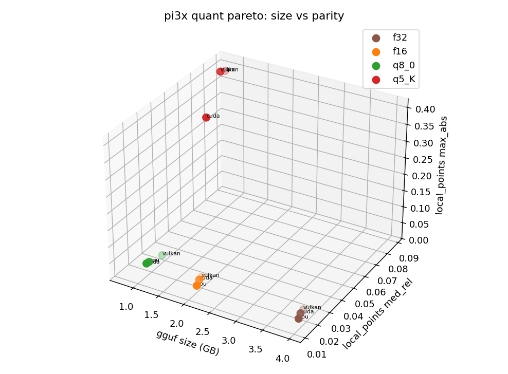
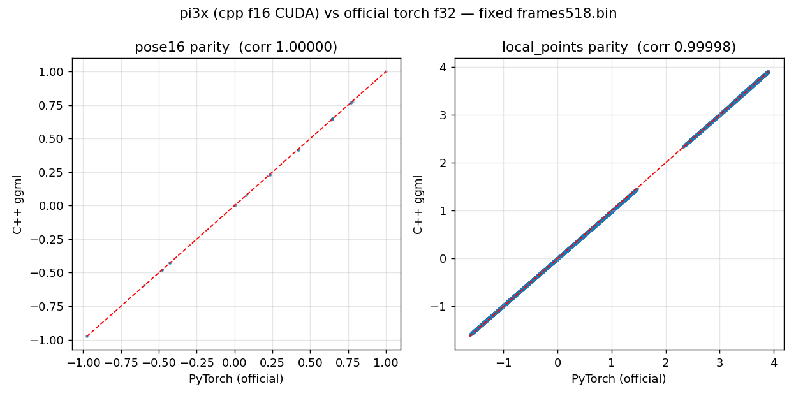
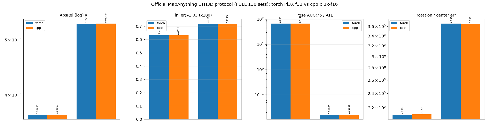
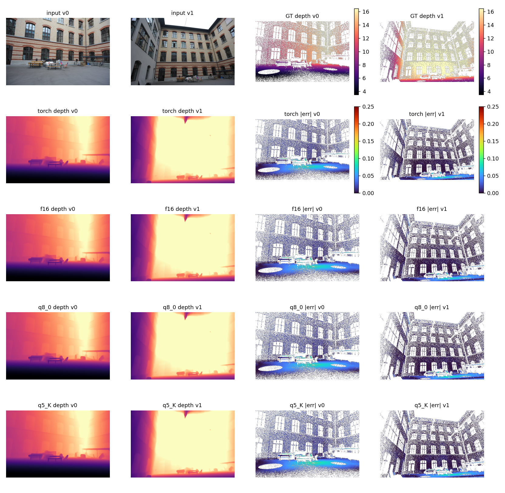
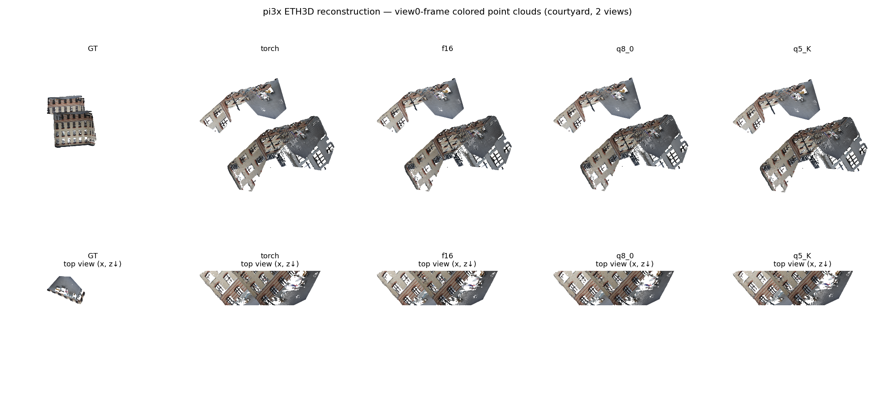
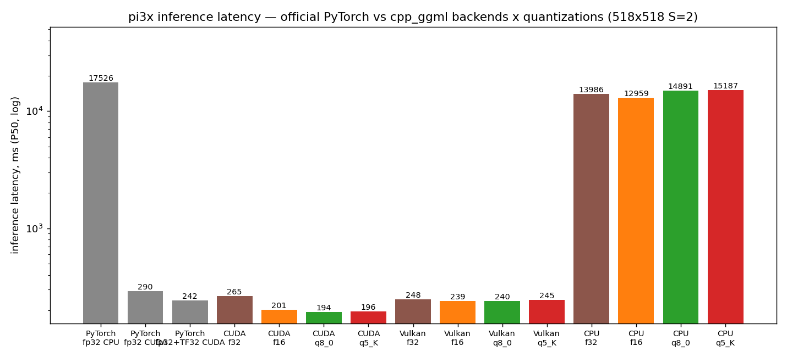

# pi3x evaluation report — C++ ggml vs official PyTorch

> 2026-09-22 · official torch f32 forward vs cpp `pi3x-{f16,q8_0,q5_K}.gguf`
> · RTX 4090 · every number measured by this repo's own scripts, no
> hand-copied figures.

## 1. Summary

| Dimension | Result |
|---|---|
| Gate matrix (4 quants x CPU/CUDA/Vulkan) | **12/12 PASS** (thresholds calibrated to pi3x's own f16-KV noise floor) |
| Official ETH3D 130 sets (MapAnything protocol, two-sided) | deltas <= 0.3% on every metric (pointmaps 0.05334/0.05345) |
| Paper protocol, 13 scenes (Acc/Comp/NC + Umeyama/ICP) | torch/cpp deltas <= 0.0021 on every metric |
| Speed (518x518 S=2 P50) | **CUDA 1.44-1.50x, Vulkan 1.21x, CPU 1.15-1.35x — faster than official torch fp32 across the board** |

## 2. End-to-end accuracy

### 2.1 Quantization x backend heatmap (pose16 max_abs, all PASS)



### 2.2 Quantization Pareto (file size vs local_points med_rel vs pose16 max)



- f16 2.75 GB / q8_0 ~1.5 GB / q5_K ~1.3 GB; the q5_K ConvHead chain is
  sensitive to 4.5-bit weights (lp med_rel ~6x the floor) — **q8_0 is the
  recommended quant**.

### 2.3 Parity scatter (cpp f16 vs torch f32, 50k sampled points)



corr >= 0.9998; full gate numbers in
[results/pi3x/](../../results/pi3x/) and
[gate_matrix.md](../../results/gate_matrix.md).

## 3. Official ETH3D protocol (130 sets, 518x336, two-sided)

| Metric | torch f32 | cpp f16 |
|---|---|---|
| pointmaps_abs_rel | 0.053340 | 0.053448 |
| z_depth_abs_rel | 0.036922 | 0.036927 |
| pose_ate_rmse | 0.016232 | 0.016280 |
| pose_auc_5 | 66.92 | **67.08** |
| rot_err_deg | 2.108 | 2.113 |
| metric_scale_abs_rel | 0.250733 | 0.251058 |



## 4. Real-scene reconstruction comparison (courtyard, window [5, 0], 518x336)

| metric | torch | f16 | q8_0 | q5_K |
|---|---|---|---|---|
| AbsRel | 0.015779 | 0.015774 | 0.016317 | 0.017492 |
| d1 | 0.999368 | 0.999368 | 0.999368 | 0.999368 |
| chamfer | 0.011814 | 0.011735 | 0.011897 | 0.012413 |
| fscore | 0.981632 | 0.981998 | 0.981998 | 0.982204 |
| pose rot diff (deg) | — | 0.028 | 0.088 | 0.905 |
| pose trans diff (m) | — | 0.005 | 0.032 | 0.053 |

### Depth comparison (input/GT + per-source depth and error maps)



### World-frame colored point clouds (front + top views)



Numbers: [recon_comparison.md](recon_comparison.md).

## 5. Speed (P50, ms, log axis)



| Backend | torch fp32 | torch +TF32 | cpp f32 | cpp f16 | cpp q8_0 | cpp q5_K |
|---|---|---|---|---|---|---|
| CUDA | 290.3 | 242.2 | 265.4 | **201.2 (1.44x)** | **193.7 (1.50x)** | **196.0 (1.48x)** |
| Vulkan | — | — | 248.4 | **239.0 (1.21x)** | 240.5 | 245.0 |
| CPU | 17525.5 | — | 13985.7 (1.25x) | **12958.9 (1.35x)** | 14890.5 (1.18x) | 15186.9 (1.15x) |

CPU note: the ggml library's default thread count is 4; the CLI now
defaults to `hardware_concurrency` (override with `--threads`; thread-count
independence verified bit-exactly). Re-measured 2026-09-24: the CPU row
comes from an exclusive retest and the f32 column is new (the earlier
CUDA/Vulkan f32 values were contaminated by a concurrent build — 265
reported as 526 — and have been re-measured).

## 6. Reproduce

```bash
# gate matrix (12 cells)
scripts/e2e_gate_matrix.sh pi3x "f16 f32 q8_0 q5_K"
# official ETH3D bench (two-sided)
python3 scripts/bench_official_eth3d.py ... --arch pi3x --num-sets 130 --resolution 518x336
# paper protocol (13 scenes)
python3 scripts/eval_pi3_paper_eth3d.py ... --side torch --arch pi3x
python3 scripts/eval_pi3_paper_eth3d.py ... --side cpp   --arch pi3x
# reconstruction comparison + charts
PYTHONPATH=/tmp/torch_cuda_lib:. python3 scripts/compare_reconstruction_pi3x.py --data-root ... --metadata-dir ...
python3 scripts/plot_charts_pi3x.py
```
