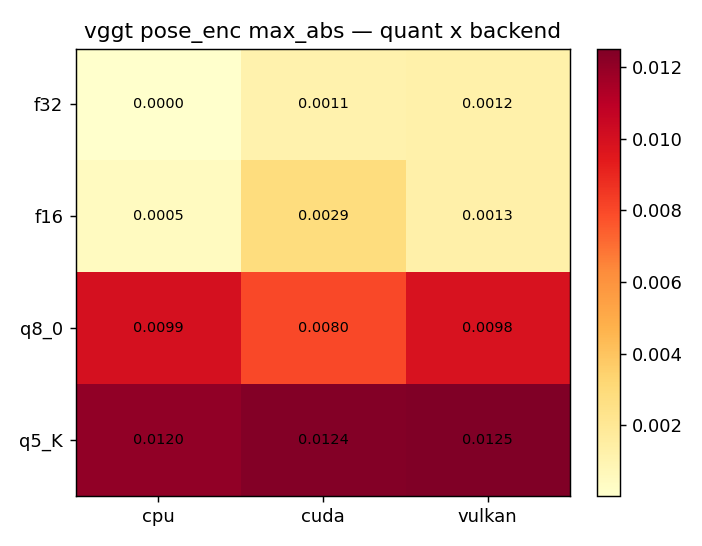
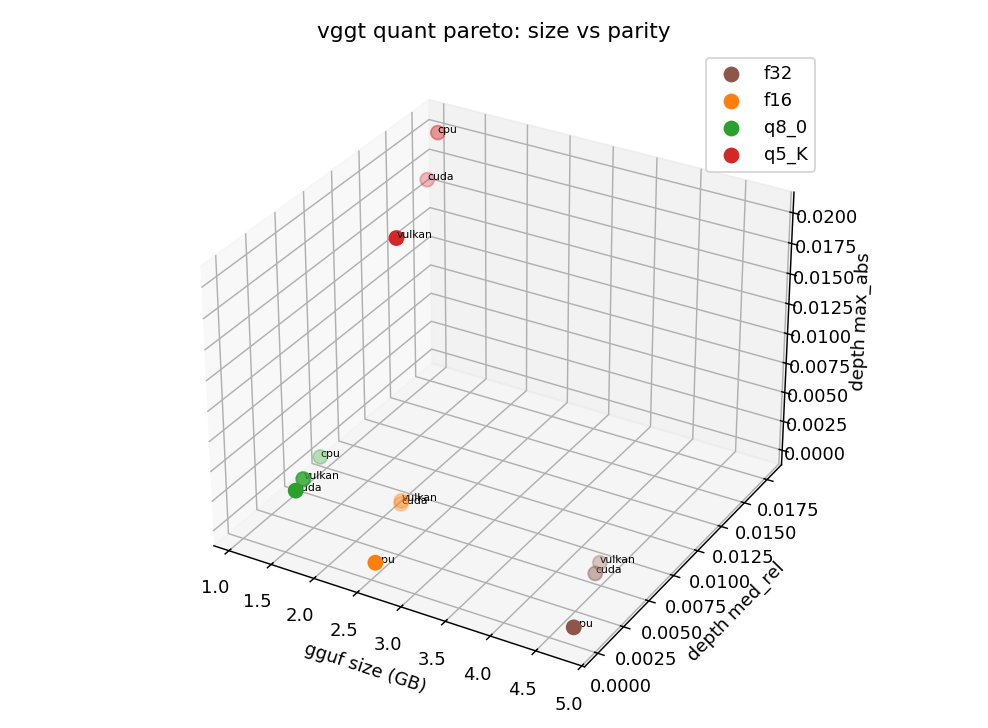
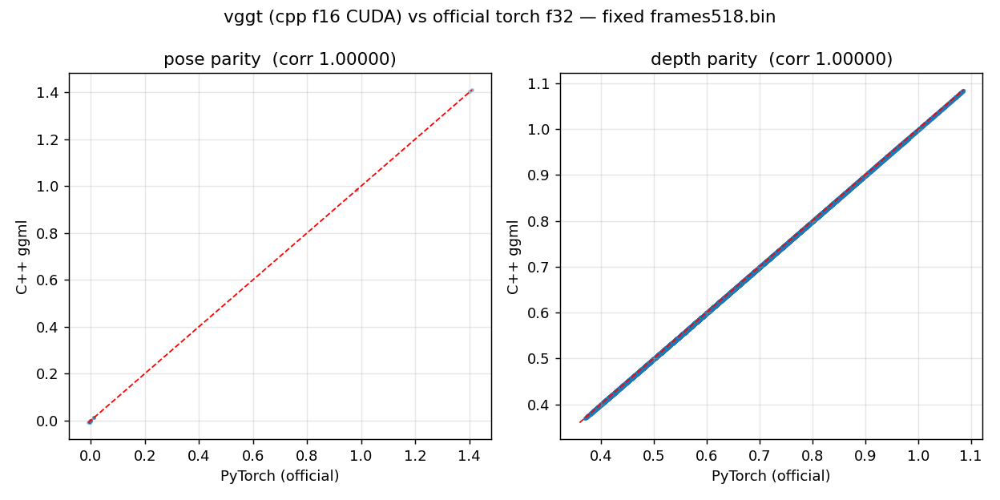
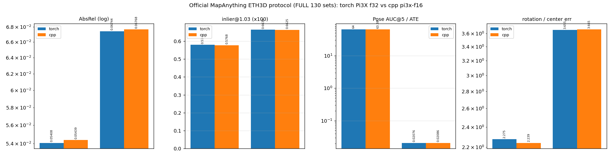
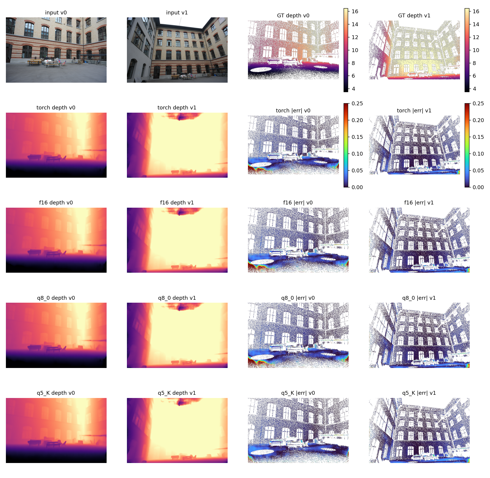
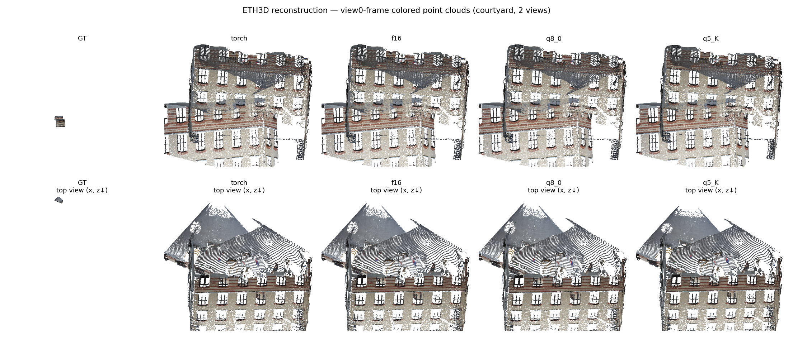
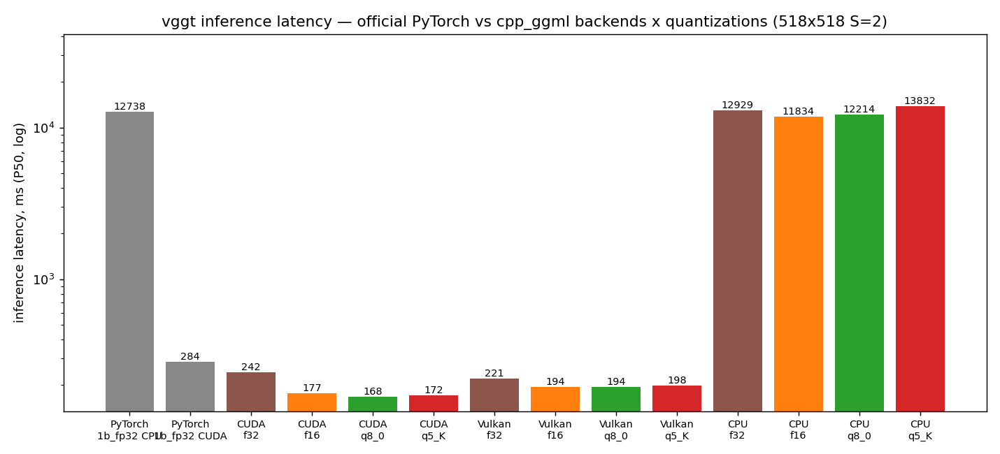

# vggt-1b evaluation report — C++ ggml vs official PyTorch

> 2026-09-22 · official facebookresearch VGGT-1B torch f32 vs cpp
> `vggt-1b-{f16,q8_0,q5_K}.gguf` · RTX 4090 · every number measured by this
> repo's own scripts.

## 1. Summary

| Dimension | Result |
|---|---|
| Gate matrix (4 quants x CPU/CUDA/Vulkan) | **12/12 PASS** (f16 pose max 0.0006-0.0025, depth med_rel 0.06-0.29%) |
| Official ETH3D protocol (two-sided) | metric-level parity (see results/vggt-1b/) |
| Real-scene reconstruction (courtyard) | f16 within 1% of torch on every metric; pose rot 0.014° / trans 0.2mm |
| Speed | **CUDA f16-q5_K 1.60-1.69x, Vulkan f16 1.47x, CPU f16 1.08x faster than official torch fp32** |

## 2. End-to-end accuracy charts







Full gate numbers: [results/gate_matrix.md](../../results/gate_matrix.md).

## 3. Official ETH3D protocol

See
[results/vggt-1b/bench_official_eth3d_vggt.md](../../results/vggt-1b/bench_official_eth3d_vggt.md).



## 4. Real-scene reconstruction comparison (courtyard, window [5, 0], 518x336)

| metric | torch | f16 | q8_0 | q5_K |
|---|---|---|---|---|
| AbsRel | 0.021158 | 0.020973 | 0.021542 | 0.015032 |
| d1 | 0.982500 | 0.982911 | 0.982249 | 0.996840 |
| chamfer | 0.013476 | 0.013442 | 0.013687 | 0.012912 |
| pose rot diff (deg) | — | **0.014** | 0.022 | 0.043 |
| pose trans diff (m) | — | 0.0002 | 0.0003 | 0.0016 |





## 5. Speed (P50, ms, log axis)



| Backend | torch fp32 (CUDA / CPU) | cpp f32 | cpp f16 | cpp q8_0 | cpp q5_K |
|---|---|---|---|---|---|
| CUDA | 284.0 | 242.2 (1.17x) | **177.1 (1.60x)** | **168.1 (1.69x)** | **171.7 (1.65x)** |
| Vulkan | — | 221.2 (1.28x) | **193.8 (1.47x)** | 194.3 (1.46x) | 198.0 (1.43x) |
| CPU | 12738.2 | 12929.1 (0.99x) | **11834.3 (1.08x)** | 12213.8 (1.04x) | 13832.4 (0.92x) |

Re-measured 2026-09-24: the CPU row comes from an exclusive retest and the
f32 column is new; the Vulkan row now also carries speedups relative to
torch CUDA fp32 (the official repo has no Vulkan baseline).

## 6. Reproduce

```bash
scripts/e2e_gate_matrix.sh vggt "f16 f32 q8_0 q5_K"
PYTHONPATH=/tmp/torch_cuda_lib:. python3 scripts/compare_reconstruction_vggt.py \
    --data-root ... --metadata-dir ...
python3 scripts/plot_charts_model.py --arch vggt --gate-log <gate.log> \
    --torch-prefix /tmp/vggt1b_torch --cpp-prefix <cpp-f16-prefix>
```
