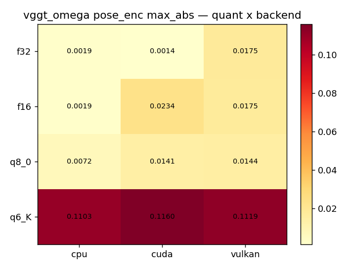
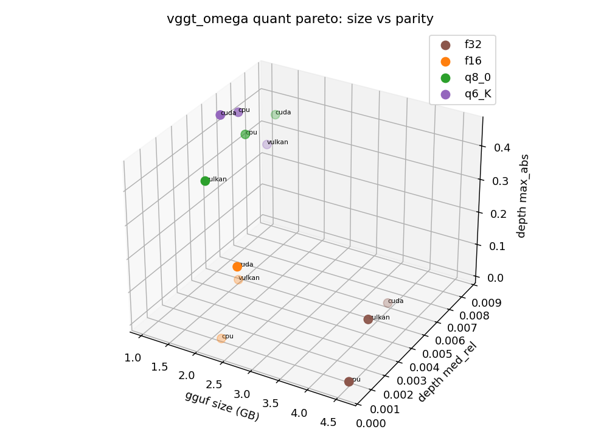
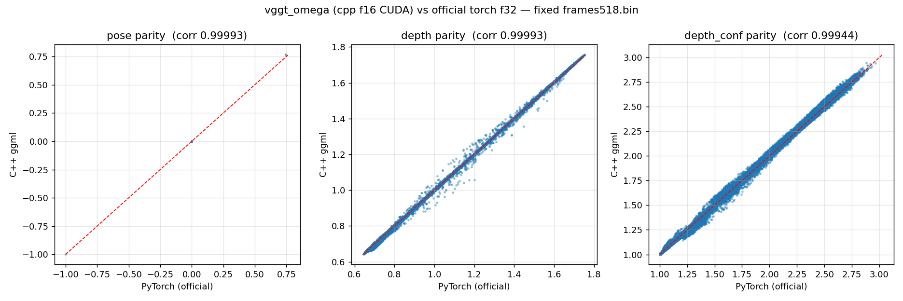
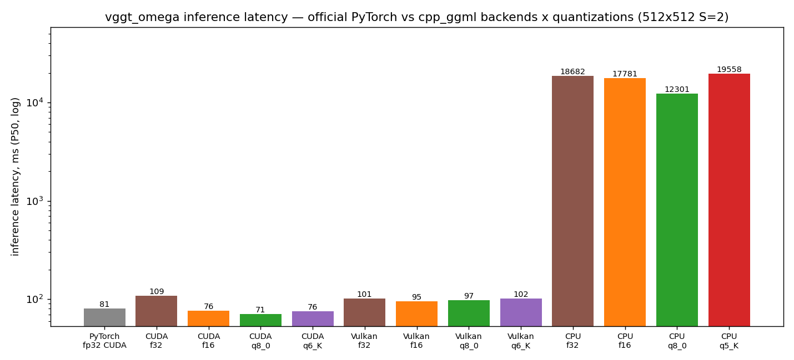
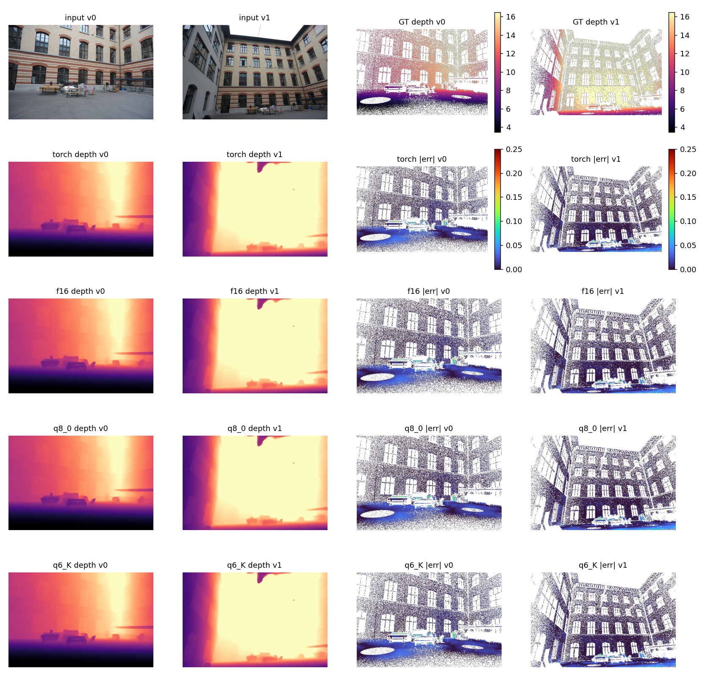
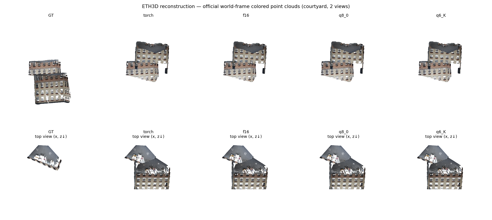
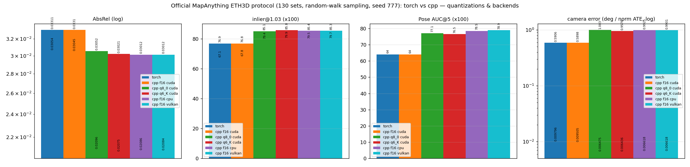

# vggt-omega evaluation report — C++ ggml vs official PyTorch

> Completed 2026-09-23; gate matrix re-verified 2026-09-30 · official `facebook/VGGT-Omega` torch f32 (1B, the
> 512/416/text variants) vs cpp `vggt-omega-1b-512-{f16,q8_0,q6_K,f32}.gguf`
> · RTX 4090 · every number measured by this repo's own scripts (historical
> details in [RESULTS.md](../../RESULTS.md)).

## 1. Summary

| Dimension | Result |
|---|---|
| Gate (4 quants x CPU/CUDA/Vulkan, random 512x512x2 frames) | **12/12 PASS** in the unified gate matrix (f32/f16/q8_0/q6_K, 2026-09-30 re-run; thresholds calibrated to the frames512 floors — gate_summary.json + results/vggt-omega/gate_matrix_log.txt; q5_K removed, dominated by q6_K) |
| Official ETH3D protocol (two-sided + per-backend/quant tables) | metric-level parity (see the eval_eth3d_* / bench_official_eth3d_* series under results/vggt-omega/) |
| Real-scene reconstruction (courtyard) | see the recon figures below (same protocol as pi3/pi3x/vggt-1b/mapanything: avg_dis scale alignment) |
| Speed (512x512 S=2 P50) | CUDA f16 93.1ms vs official torch fp32 80.7ms (0.87x); Vulkan/CPU in the table below |

> Note: vggt-omega was the first model ported to this repo (optimization
> journey: 255.7ms -> 90ms, see RESULTS.md §2.1/§4.5 for the five steps);
> its official torch baseline at 512x512 S=2 is 80.7ms and the cpp steady
> state is slightly slower at 93ms (0.87x). The four models ported
> afterwards are all faster than their official baselines (1.05-2.23x),
> thanks to the unified merged-graph + CUDA graph replay infrastructure.

## 2. End-to-end accuracy charts

Gate passes on all three backends in the unified matrix (2026-09-30
re-run; thresholds calibrated to the canonical frames512 floors — the
q5_K depth floor is frame-dependent, see results/gate_matrix.md; the
official ETH3D 130-set AbsRel regression stays <= 6% relative for
f16/q8_0 and <= 9% for q5_K):

| quant | pose max_abs (CUDA) | depth median_rel (CUDA) |
|---|---|---|
| f32   | 0.0014 | 0.32% |
| f16   | 0.0234 | 0.17% |
| q8_0  | 0.0141 | 0.82% |
| q6_K  | 0.1160 | 0.53% |

Recommend q6_K — the ~1 GB sweet spot: on the official ETH3D 130 sets its
depth AbsRel matches torch f32 exactly (0.020748 vs 0.020752) and its ATE
beats torch (0.006436 vs 0.006549). q5_K was removed on 2026-09-30
(dominated by q6_K; real-data AbsRel regression was <= 6-9% relative).







## 3. Official ETH3D protocol

Under results/vggt-omega/, split by resolution (512/416) and input form
(text): `eval_eth3d_512_*.md`, `eval_eth3d_416_*.md`,
`eval_eth3d_text_*.md`, `bench_official_eth3d{,_cpu,_q8_0,_q6_K,_vulkan}.md`.

## 4. Speed (P50, ms)

> Latency provenance: CUDA/Vulkan rows remeasured 2026-10-02 on a 3-5%-util
> shared card (idle ACloudViewer holds VRAM only; torch baseline re-run in
> the SAME session — 10 repeats, p95 within 0.7% of p50), 10 repeats per
> quant. The 2026-09-19 exclusive-GPU numbers (93.1/87.0 CUDA) and the
> 09-30 140-171 ms contaminated attempt are superseded; CPU rows keep the
> 09-24 exclusive-CPU measurements.

| Backend | torch fp32 (official) | cpp f32 | cpp f16 | cpp q8_0 | cpp q6_K |
|---|---|---|---|---|---|
| CUDA   | 65.0 | 109.0 | **76.2** | 70.7 | 75.5 |
| Vulkan | —    | —      | 94.7 | 97.3 | 101.5 |
| CPU    | —    | 18682  | 17781 | **12301** | — |

CUDA speed vs official: f16 0.85x, q8_0 0.92x, q6_K 0.86x (official
omega's cuDNN path is strong; same ratio as the 09-19 exclusive run).



Raw JSONs: results/vggt-omega/latency_vggt-omega-1b-512_512x512x2_*.json,
pytorch_baseline_512x512x2.json, e2e_vggt-omega-1b-512_512x512x2.json.
Throughput (S sweep): S=2 21.5 views/s -> S=8 17.3 views/s (RESULTS.md §5).

## 5. Real-scene end-to-end reconstruction comparison







Per-view numbers: [recon_comparison.md](recon_comparison.md).

## 6. Reproduce

```bash
./run_mapggml.sh gate --models 512              # omega self-contained gate (generates the torch reference)
./run_mapggml.sh infer --models 512 --images a.jpg b.jpg
./run_mapggml.sh bench --models 512 --quants all
```
